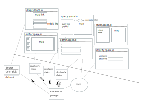

## mapspace

Orignally written in 2019-08, but deleted due to fear. Recreated

</img>

- system consists of multiple apps and their ui
- freedom, ownership and responsibility: develpers choose the tools to build such a microservice, and maintain it
- link driven: users can exachange links to maps, discussion

##  features

- `disqus`: comments links to map (like reddit/stackoverflow)  
- `query`: query entities on the map, use geospatial filters, copy map links to use in disqus
- `editor`: edit features on the map 
- `styles`: edit geoserver styles
- `admin`: authorization stuff
- `identity`: redirect -> signup/signin -> redirect

## development

- on github
- open source project
- self hostable
- company runs for its users and data